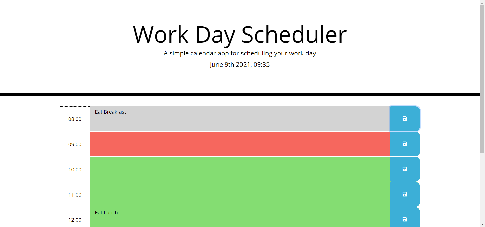

# UofO Coding Bootcamp Homework for Week 5:
## Work Day Scheduler

### The function of this website is to act as a planner for your day. It denotes the current date and time and what events have happened, are happening, and will happen in your day based on your input.
### The website can be accessed here: https://reidk361.github.io/Homework-Week-5/

> **1920p width screen example.**   

> **Note: Appearance will change based on screen resolution.** 

